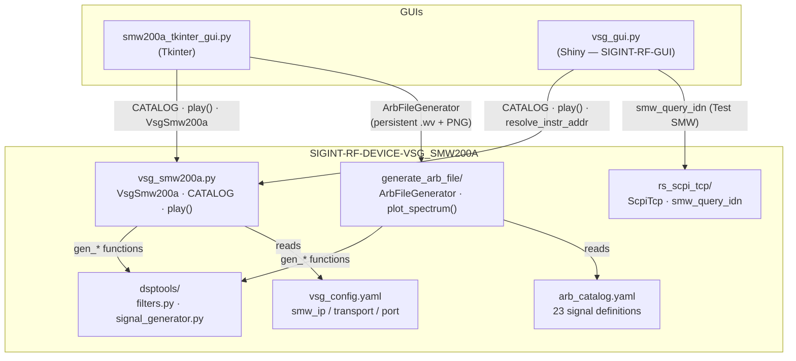

# SIGINT-RF-DEVICE-VSG_SMW200A

Python toolkit for the **Rohde & Schwarz SMW200A** vector signal generator.
Generates ARB I/Q waveforms from a signal catalog, uploads them to the instrument via VISA, and controls carrier frequency / RF output — all without needing a software option licence for each modulation (uses the permanent ARB path B9 + K515 + K527).

---

## Quick start

```powershell
# 1. Clone and install (creates .venv automatically if you use Poetry, or plain pip)
cd SIGINT-RF-DEVICE-VSG_SMW200A
pip install -e .

# 2. Set the instrument IP once
#    Edit SIGINT-RF-DEVICE-VSG_SMW200A/vsg_config.yaml  →  smw_ip: "169.254.2.20"

# 3. Launch the Tkinter GUI
python .\code_snippets\smw200a_tkinter_gui.py --gui

# 4. Or generate a .wv file offline (no instrument needed)
python .\SIGINT-RF-DEVICE-VSG_SMW200A\generate_arb_file\generate_arb_file.py atc_am
```

> **RF safety** — always use a conducted/shielded setup (cable + attenuator or screened chamber).
> Never radiate distress frequencies (EPIRB 406 MHz, ELT 121.5 MHz, ADS-B 1090 MHz, maritime Ch16/Ch70) outdoors.

---

## Module map



---

## Repository layout

```text
SIGINT-RF-DEVICE-VSG_SMW200A/          ← repo root
  pyproject.toml
  SIGINT-RF-DEVICE-VSG_SMW200A/        ← installable Python sources
    vsg_smw200a.py                     ← central module: VsgSmw200a, CATALOG, play()
    vsg_config.yaml                    ← instrument IP / transport defaults
    rs_scpi_tcp/                       ← raw TCP SCPI (no VISA required)
      __init__.py
      rs_scpi_tcp.py
    dsptools/                          ← DSP helpers and I/Q generators
      __init__.py
      filters.py                       ← normalize, rrc_filter, gaussian_pulse, …
      signal_generator.py              ← gen_am_dsb, gen_fm, gen_gmsk, gen_psk, …
    generate_arb_file/                 ← standalone .wv file generator + spectrum PNG
      __init__.py
      generate_arb_file.py             ← ArbFileGenerator class, write_wv, plot_spectrum
      __main__.py                      ← CLI: python -m generate_arb_file <signal>
  code_snippets/
    smw200a_tkinter_gui.py             ← Tkinter ARB catalog GUI
```

---

## What each piece does

| Module | Role |
|--------|------|
| `vsg_smw200a.py` | **Central application layer.** `VsgSmw200a` (VISA session), `CATALOG` (23 `CatalogEntry` objects), `play()` (generate I/Q → write .wv → upload → set carrier/power → RF on). Imports generators from `dsptools`. Reads `vsg_config.yaml` for instrument defaults. |
| `dsptools/signal_generator.py` | **I/Q generators.** Each returns `(complex_array, sample_rate_hz)`. 14 modulations: AM-DSB, FM, GMSK, 2-FSK, 4-FSK, π/4-DQPSK, PSK, QAM, 16-APSK, LFM pulse, Barker pulse, ADS-B PPM, multitone, AWGN. |
| `dsptools/filters.py` | **DSP primitives** used by the generators: `normalize`, `rrc_filter`, `gaussian_pulse`, `random_bits`, `shape_symbols`. |
| `rs_scpi_tcp/` | **Raw TCP SCPI** (stdlib only, no VISA stack). `smw_query_idn` (*IDN? ping), `smw_set_cw`, `fsw_configure_spectrum`, `fsw_bw_summary`. Used by the **Test SMW** button in both GUIs. |
| `generate_arb_file/` | **Offline .wv generator.** `ArbFileGenerator` class: `generate()` → saves `output/arb_signals.wv` + `output/arb_signals.png` (spectrum preview). Reads `CATALOG` from `vsg_smw200a` directly. No instrument required. |
| `vsg_config.yaml` | Instrument defaults. Edit `smw_ip` to point at your SMW200A. Can be overridden with `SMW_*` env vars. |

---

## `vsg_smw200a` vs `rs_scpi_tcp` — when to use each

| Task | Use |
|------|-----|
| Generate waveform, upload .wv, set freq/power, RF on | `vsg_smw200a.play()` |
| Full instrument API (RsSmw) | `vsg_smw200a.VsgSmw200a` |
| Quick `*IDN?` to verify reachability | `rs_scpi_tcp.smw_query_idn` |
| Configure FSW spectrum (center, span, RBW) | `rs_scpi_tcp.fsw_configure_spectrum` |
| Generate .wv + spectrum PNG without connecting to the instrument | `generate_arb_file.ArbFileGenerator` |
| No VISA stack on the PC | `rs_scpi_tcp` or `generate_arb_file` only |

---

## Adding a new signal

Adding a signal means two edits: one in **`dsptools/signal_generator.py`** (only if you need a new modulation) and one in **`vsg_smw200a.py`** (always). Optionally update `arb_catalog.yaml` for the offline generator.

### Step 1 — Write the I/Q generator (only if new modulation)

Add your function to `dsptools/signal_generator.py`. The signature must return `(complex_array, sample_rate_hz)`:

```python
# dsptools/signal_generator.py

def gen_my_signal(
    fs: float = 1e6,
    rs: float = 100e3,
    nsym: int = 512,
    seed: int = 42,
) -> tuple[np.ndarray, float]:
    """My new modulation — one-line description."""
    # ... numpy I/Q computation ...
    return normalize(iq), fs
```

Rules:
- All parameters must have defaults so `gen_my_signal()` works with no arguments.
- Use keyword-only or positional parameters — the GUI introspects them with `list_generator_param_specs()` and shows them as editable fields automatically.
- `normalize()` from `dsptools.filters` scales to ±1 full-scale.

### Step 2 — Register in the Python CATALOG

Open `vsg_smw200a.py` and add an entry to the `CATALOG` dict (around line 560):

```python
# vsg_smw200a.py  — CATALOG dict

from dsptools.signal_generator import gen_my_signal   # add import at the top

CATALOG: dict[str, CatalogEntry] = {
    # ... existing entries ...
    "my_signal": CatalogEntry(
        gen=gen_my_signal,
        carrier_hz=433.920e6,       # RF carrier in Hz
        power_dbm=-40,              # conducted output power in dBm
        description="My signal description",
        permanent_delivery=PERMANENT_ARB,
        trial_native="",            # what native SMW option could do this, or ""
    ),
}
```

If you need fixed generator kwargs (e.g. BPSK = `order=2` for a generic PSK function), use `functools.partial`:

```python
import functools
"my_bpsk": CatalogEntry(
    gen=functools.partial(gen_psk, order=2),
    carrier_hz=2025e6, power_dbm=-40,
    description="BPSK example",
    permanent_delivery=PERMANENT_ARB, trial_native="",
),
```

### Step 3 — Update `arb_catalog.yaml` *(no longer needed)*

`generate_arb_file` now reads `CATALOG` directly from `vsg_smw200a`. Nothing else to do — your new signal is immediately available in all tools once you added it to the Python `CATALOG`.

### Verify

```powershell
# List all signals (should include yours)
python .\code_snippets\smw200a_tkinter_gui.py --list

# Generate .wv offline + spectrum PNG
python .\SIGINT-RF-DEVICE-VSG_SMW200A\generate_arb_file\generate_arb_file.py my_signal

# Dry-run (generate .wv, do NOT upload or enable RF)
python .\code_snippets\smw200a_tkinter_gui.py --signal my_signal --dry-run
```

---

## Configuration

`vsg_config.yaml` controls the VISA connection. Priority (highest first): explicit `play(instr_addr=...)` → `SMW_*` env vars → `vsg_config.yaml` → built-in defaults.

```yaml
smw_ip: "169.254.2.20"
smw_transport: "hislip"   # hislip | socket
smw_socket_port: 5025
# smw_visa: "TCPIP::169.254.2.20::HISLIP"  # full override
```

---

## Installation

```powershell
cd SIGINT-RF-DEVICE-VSG_SMW200A
pip install -e .
# With dev extras (pytest, ruff, mypy, black):
pip install -e ".[dev]"
```

Requires Python ≥ 3.14, a VISA runtime (R&S VISA or NI-VISA) for `VsgSmw200a` / `play()`, NumPy, PyYAML, matplotlib (for spectrum preview).

---

## License

MIT — see `pyproject.toml`.
